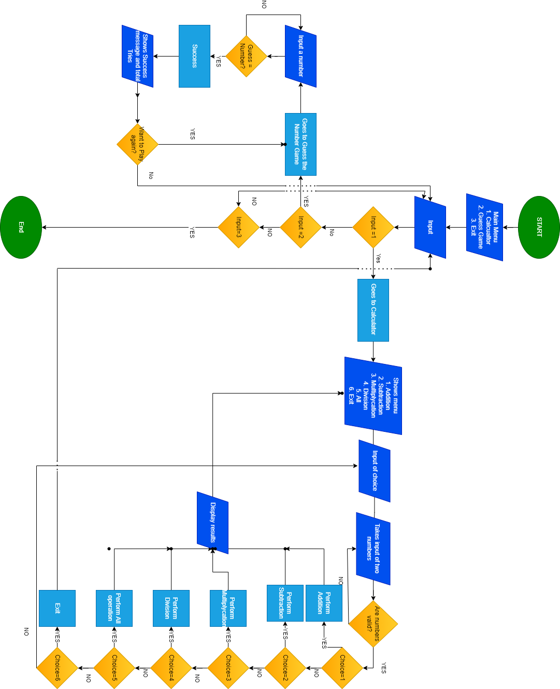

# Group-Vxaxm-PythonProject

## Team Members
- Muhammad Salman Ali Malik(Team Lead)
- Muhammad Nouman Majeed

## Project Description
This project contains two Python programs:
1. Smart Calculator
2. Number Guessing Game
3. Using GitHub to collaborate on te project
### Samrt Calculator

- Welcomes the user and asks for two numbers.
- Validates inputs to ensure only numbers are entered.
- Do operations like:
  1. Addition
  2. Subtraction
  3. Multiplication
  4. Division
  5. Perform all operations
  6. Exit

### Guess The Number

1. The computer randomly selects a number between 1 and 50.
2. The user tries to guess the number, receiving feedback:
3. "Too High" if the guess is higher than the number.
4. "Too Low" if the guess is lower than the number.
5. The game keeps track of the number of guesses.
6. When the user guesses correctly, it displays the correct number and total attempts.
7. After each round, the user can choose to play again or exit from the program

### Program logic(Flowchart)

